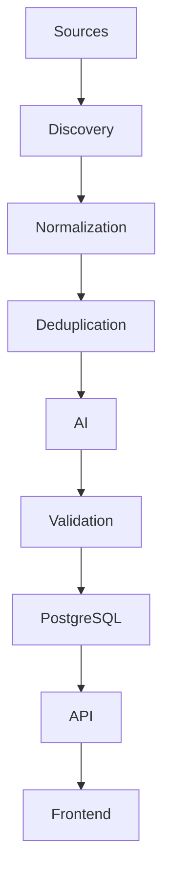
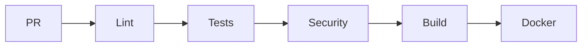
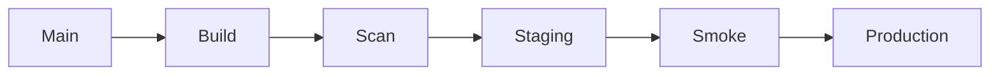

# Dev Atlas

## Autonomous Developer Intelligence & CI/CD Platform

You are a senior software architect, backend engineer, DevOps engineer, security engineer, data engineer, and UI/UX designer.

Build a **production-grade, portfolio-defining full-stack application called “DevAtlas”**.

DevAtlas is an autonomous developer intelligence platform that continuously discovers useful information from the internet, processes and validates it, uses AI to classify and summarize it, stores it, generates daily intelligence reports, and automatically deploys changes through a sophisticated GitHub Actions CI/CD pipeline.

The primary goal is not simply to create an application.

The primary goal is to create a project that demonstrates **exceptionally strong real-world CI/CD, DevOps, software engineering, automation, AI integration, testing, security, observability, infrastructure, and GitHub engineering practices**.

The resulting GitHub repository should look like something an ambitious junior/mid-level engineer would build to demonstrate serious DevOps and backend capability.

---

# 1. CORE PRODUCT CONCEPT

DevAtlas automatically discovers and organizes useful developer information.

Every day it should attempt to discover:

* AI developer tools
* AI models
* AI APIs
* Software engineering tools
* Open-source GitHub repositories
* Software/AI jobs
* Hackathons
* Developer news
* Cloud/DevOps tools
* Security/CVE information
* Developer resources
* Courses and learning resources
* Interesting new technologies

The platform should:

1. Collect data
2. Normalize it
3. Validate it
4. Deduplicate it
5. Categorize it
6. Enrich it
7. Score its relevance
8. Generate AI summaries
9. Store it
10. Run automated quality checks
11. Generate a daily report
12. Commit meaningful generated artifacts when appropriate
13. Deploy automatically
14. Monitor the deployment
15. Support rollback

Do NOT create meaningless commits simply to produce a green GitHub contribution graph.

The system should commit only when meaningful content or application changes actually occur.

If there are no meaningful changes, the pipeline should complete successfully without creating a commit.

---

# 2. DESIGN PHILOSOPHY

The project should feel like:

> “A real production system that happens to be an excellent CI/CD demonstration.”

It must NOT feel like:

* a tutorial project
* a CRUD demo
* a fake DevOps project
* a script that makes daily commits
* a simple web scraper
* an AI wrapper
* a dashboard with hardcoded data

Prioritize:

* Clean architecture
* Maintainability
* Security
* Testability
* Automation
* Observability
* Reliability
* Excellent documentation
* Meaningful Git history
* Production-like deployment
* Developer experience

---

# 3. TECHNOLOGY STACK

Use the following stack unless there is a compelling technical reason to change something.

## Backend

* Java 21+
* Spring Boot 3+
* Spring Web
* Spring Data JPA
* Spring Validation
* Spring Security
* PostgreSQL
* Flyway
* Redis
* Maven

Architecture:

* Modular monolith initially
* Clear domain boundaries
* REST API
* Background workers/services
* Event-oriented internal architecture where useful

Do NOT prematurely create dozens of microservices.

The code should demonstrate good architecture without unnecessary complexity.

---

# 4. FRONTEND

Use:

* Next.js
* TypeScript
* Tailwind CSS
* Modern component architecture
* Responsive design
* Accessible UI
* Dark/light mode

The UI should look like a premium developer SaaS product.

Visual direction:

* Minimal
* Monochrome
* High contrast
* Sophisticated typography
* Dense but readable information
* Subtle animations
* Excellent spacing
* Professional dashboards
* No excessive gradients
* No generic “AI startup” visual clichés

The UI should feel comparable to a polished developer product.

---

# 5. CORE MODULES

Create the following major modules.

## A. Discovery Engine

Responsible for finding new information.

Sources can include:

* GitHub
* RSS feeds
* Public APIs
* Job APIs
* Hacker News
* Public technology feeds
* Official product feeds
* Other legitimate public sources

Never use aggressive scraping.

Respect:

* robots.txt where applicable
* API terms
* rate limits
* authentication requirements
* reasonable request frequency

Implement source adapters using an interface such as:

```java
public interface DiscoverySource {
    List<DiscoveredItem> discover();
}
```

Example implementations:

```text
GitHubDiscoverySource
JobDiscoverySource
RSSDiscoverySource
HackerNewsDiscoverySource
AIModelDiscoverySource
SecurityDiscoverySource
```

The architecture must make adding a new source easy.

---

# 6. NORMALIZATION PIPELINE

Raw source data should never immediately enter the database.

Create a pipeline:

```text
RAW DATA
   ↓
Normalization
   ↓
Validation
   ↓
Canonicalization
   ↓
Deduplication
   ↓
Enrichment
   ↓
Classification
   ↓
Scoring
   ↓
AI Processing
   ↓
Persistence
```

Normalize:

* titles
* URLs
* timestamps
* company names
* source names
* descriptions
* tags
* categories

Canonicalize URLs so the same resource is not stored multiple times.

---

# 7. DEDUPLICATION

Implement robust duplicate detection.

At minimum:

### Exact URL matching

```text
https://example.com/tool
```

and

```text
https://example.com/tool/
```

should be treated as the same resource.

### Content similarity

Where practical, use:

* normalized title
* normalized description
* source identifiers
* optional embeddings

to detect near duplicates.

Every discovered item should have a deterministic identity.

Example:

```text
content_hash
canonical_url
source_id
```

---

# 8. CATEGORIES

Support categories such as:

```text
AI
AI Models
AI APIs
Developer Tools
Open Source
Jobs
Cloud
DevOps
Cybersecurity
Databases
Frontend
Backend
Mobile
Learning
Hackathons
News
Productivity
```

Allow multiple tags per item.

Example:

```json
{
  "category": "Developer Tools",
  "tags": [
    "AI",
    "Coding Assistant",
    "VS Code",
    "Productivity"
  ]
}
```

---

# 9. AI PROCESSING

Integrate an LLM through a clean provider abstraction.

Example:

```java
public interface AIProvider {
    ClassificationResult classify(ContentItem item);

    SummaryResult summarize(ContentItem item);

    ScoreResult score(ContentItem item);
}
```

Do not hard-code the application around one AI provider.

Allow providers to be swapped.

AI should perform:

* classification
* summarization
* tag generation
* relevance scoring
* duplicate assistance
* daily report generation

Use structured output.

Never blindly trust model output.

Validate AI responses against schemas.

Example:

```json
{
  "category": "AI",
  "summary": "...",
  "tags": ["LLM", "Developer Tools"],
  "relevanceScore": 91
}
```

Reject malformed AI responses.

Implement retry logic with exponential backoff.

Implement timeouts.

Implement rate limiting.

---

# 10. RELEVANCE SCORING

Create a transparent scoring system.

Example:

```text
Freshness          20%
Popularity         20%
Developer Value    25%
Technology Impact  20%
Source Quality     15%
```

Produce:

```text
0–49   Low
50–69  Moderate
70–84  High
85–100 Exceptional
```

Show the reason for scores when possible.

Avoid creating arbitrary scores with no explanation.

---

# 11. JOB INTELLIGENCE

Create a dedicated jobs section.

Each job should contain:

```text
Title
Company
Location
Remote status
Salary if available
Employment type
Skills
URL
Source
Published date
Discovered date
Relevance score
```

Support filtering:

* Remote
* India
* Bengaluru
* Mumbai
* Hyderabad
* International
* AI/ML
* Backend
* Frontend
* DevOps
* Java
* Python
* Cloud
* Entry-level
* Internship

Do not invent job data.

Only display information actually obtained from sources.

---

# 12. AI TOOLS DIRECTORY

Create an AI tools directory.

Each tool can contain:

```text
Name
Description
Category
Website
GitHub
Pricing
Open source
API availability
Tags
Relevance score
First discovered
Last updated
Source
```

Support categories:

```text
Coding
Design
Research
Productivity
Marketing
Video
Audio
Data
Agents
Developer Infrastructure
Automation
```

---

# 13. GITHUB INTELLIGENCE

Track interesting open-source repositories.

Display:

```text
Repository
Stars
Forks
Language
License
Last update
Stars gained
Contributors
Topics
Description
Relevance
```

Calculate trends such as:

```text
Trending
Fast Growing
New
Established
```

Do not artificially star repositories or interact with other users.

Use GitHub APIs responsibly.

---

# 14. DAILY INTELLIGENCE REPORT

Every successful daily pipeline should generate a report.

Example:

```text
reports/
    2026/
        09/
            06.md
            07.md
            08.md
```

The report should include:

## Top discoveries

Top AI tools, repositories, jobs, and technologies.

## Developer ecosystem changes

What changed since the previous report.

## Trending projects

Fast-growing GitHub projects.

## Job market

Interesting new positions.

## AI landscape

New models, tools, APIs, frameworks.

## Security

Important security updates where available.

## Recommendations

AI-generated “worth checking out” section.

---

# 15. DAILY AUTOMATION

Create a GitHub Actions workflow:

```text
daily-discovery.yml
```

It should run on a scheduled cron.

Also support:

```text
workflow_dispatch
```

for manual execution.

Pipeline:

```text
Checkout
 ↓
Setup environment
 ↓
Run discovery
 ↓
Normalize
 ↓
Deduplicate
 ↓
AI processing
 ↓
Validate
 ↓
Run tests
 ↓
Generate report
 ↓
Persist data
 ↓
Detect meaningful changes
 ↓
Commit only if needed
 ↓
Push
```

If no meaningful changes exist:

```text
No meaningful changes detected.
Skipping commit.
```

---

# 16. CI PIPELINE

Create:

```text
.github/workflows/ci.yml
```

Run on:

* Pull requests
* Pushes to main
* Pushes to development branches where appropriate

Pipeline:

```text
Checkout
 ↓
Java setup
 ↓
Node setup
 ↓
Dependency cache
 ↓
Lint
 ↓
Unit tests
 ↓
Integration tests
 ↓
API tests
 ↓
Build
 ↓
Docker build
 ↓
Security scans
 ↓
Coverage
 ↓
Artifact generation
```

CI must fail if critical quality checks fail.

---

# 17. TESTING STRATEGY

Implement multiple testing layers.

## Unit tests

Test:

* services
* scoring
* normalization
* deduplication
* validators
* AI response parsing

## Integration tests

Use:

* Testcontainers
* PostgreSQL
* Redis

Test real infrastructure behavior.

## API tests

Test:

* authentication
* pagination
* filtering
* validation
* error handling
* authorization

## End-to-end tests

Test important user flows.

Example:

```text
Open dashboard
→ Search AI tools
→ Filter by category
→ Open tool
→ View details
```

---

# 18. TEST QUALITY

Do not chase coverage artificially.

Aim for:

```text
80%+ meaningful backend coverage
```

Track:

* line coverage
* branch coverage

Use JaCoCo.

Upload coverage artifacts from CI.

Expose coverage in the README.

---

# 19. SECURITY

Implement serious security practices.

Use:

* Spring Security
* environment variables
* GitHub Secrets
* secret scanning
* CodeQL
* Dependabot
* Trivy
* dependency vulnerability scanning
* container scanning
* least-privilege GitHub permissions

Never commit:

```text
API keys
passwords
tokens
database credentials
private keys
```

Use:

```text
.env.example
```

with placeholders.

Example:

```env
DATABASE_URL=
DATABASE_USERNAME=
DATABASE_PASSWORD=
AI_API_KEY=
GITHUB_TOKEN=
REDIS_URL=
```

---

# 20. SBOM

Generate a Software Bill of Materials during CI/CD.

Use an appropriate tool such as:

```text
Syft
CycloneDX
```

Store SBOM artifacts with releases.

---

# 21. DOCKER

Containerize:

```text
frontend
backend
worker
```

Create:

```text
Dockerfile
docker-compose.yml
docker-compose.prod.yml
```

Use multi-stage builds.

Run containers as non-root where possible.

Add health checks.

Example:

```text
/actuator/health
```

---

# 22. DATABASE

Use PostgreSQL.

Use Flyway migrations.

Never modify production schema manually.

Migration examples:

```text
V1__initial_schema.sql
V2__create_content_items.sql
V3__create_sources.sql
V4__create_jobs.sql
V5__create_ai_tools.sql
```

Every schema change must be represented as a migration.

CI must verify migrations.

---

# 23. REDIS

Use Redis for appropriate workloads:

* caching
* rate limiting
* temporary processing state
* expensive query caching

Do not introduce Redis where PostgreSQL is sufficient.

---

# 24. API DESIGN

Create clean REST APIs.

Examples:

```text
GET /api/v1/items
GET /api/v1/items/{id}

GET /api/v1/tools
GET /api/v1/tools/{id}

GET /api/v1/jobs
GET /api/v1/jobs/{id}

GET /api/v1/repositories
GET /api/v1/repositories/{id}

GET /api/v1/reports
GET /api/v1/reports/{date}

GET /api/v1/categories

GET /api/v1/health
```

Support:

```text
pagination
sorting
filtering
search
date ranges
category filtering
tag filtering
```

Use consistent API responses.

Use appropriate HTTP status codes.

---

# 25. API DOCUMENTATION

Generate OpenAPI documentation.

Expose Swagger/OpenAPI only in appropriate environments.

Document:

* endpoints
* request schemas
* response schemas
* authentication
* errors

---

# 26. OBSERVABILITY

Implement:

* structured logging
* metrics
* health checks
* tracing where practical

Use:

```text
Micrometer
Prometheus
Grafana
OpenTelemetry
```

Track metrics such as:

```text
discovery.items.total
discovery.items.new
discovery.items.duplicates
ai.requests.total
ai.requests.failed
pipeline.duration
pipeline.success
pipeline.failure
api.requests
api.latency
database.errors
```

---

# 27. ERROR HANDLING

Never allow one broken source to destroy the entire discovery pipeline.

Example:

```text
GitHub source       ✓
RSS source          ✓
Jobs source         ✗
Hacker News         ✓
AI models           ✓
```

The pipeline should record the job-source failure and continue when possible.

At the end:

```text
Sources:
4 successful
1 failed

Pipeline:
PARTIAL SUCCESS
```

Create appropriate logs and metrics.

---

# 28. RETRY SYSTEM

Implement retries for transient failures.

Use:

```text
exponential backoff
jitter
maximum retry count
timeouts
circuit-breaking where appropriate
```

Never retry indefinitely.

---

# 29. GITHUB ACTIONS SECURITY

GitHub workflows should use least privilege.

Example:

```yaml
permissions:
  contents: read
```

Only workflows that actually need write access should receive it.

For the daily publishing workflow:

```yaml
permissions:
  contents: write
```

Avoid:

```yaml
permissions: write-all
```

Do not use unnecessary third-party actions.

Pin critical third-party actions appropriately.

---

# 30. CD PIPELINE

Create:

```text
.github/workflows/cd.yml
```

Deployment flow:

```text
main
 ↓
CI
 ↓
Build
 ↓
Docker image
 ↓
Security scan
 ↓
Push image
 ↓
Deploy staging
 ↓
Smoke tests
 ↓
Approval gate
 ↓
Production
 ↓
Health check
```

The system should support rollback.

---

# 31. DEPLOYMENT STRATEGY

For the first production version, use a relatively simple deployment architecture.

Possible target:

```text
AWS
```

Use:

```text
Terraform
Docker
GitHub Actions
PostgreSQL
Redis
```

Avoid Kubernetes unless the implementation genuinely benefits from it.

A clean Docker-based deployment is better than fake Kubernetes complexity.

---

# 32. INFRASTRUCTURE AS CODE

Create:

```text
infrastructure/
    terraform/
        main.tf
        variables.tf
        outputs.tf
        networking.tf
        database.tf
        compute.tf
```

Infrastructure should be reproducible.

Document:

```text
terraform init
terraform plan
terraform apply
```

Never commit cloud credentials.

---

# 33. STAGING AND PRODUCTION

Have separate environments:

```text
staging
production
```

Use environment-specific:

```text
variables
secrets
database
configuration
```

Production deployment should never happen directly from a developer laptop.

---

# 34. SMOKE TESTS

After deployment:

```text
GET /actuator/health
GET /api/v1/items
GET /api/v1/categories
```

Verify:

* HTTP status
* response schema
* database connectivity
* critical dependencies

If smoke tests fail:

```text
deployment = failed
```

Trigger rollback where configured.

---

# 35. RELEASE MANAGEMENT

Create:

```text
release.yml
```

Use semantic versioning:

```text
MAJOR.MINOR.PATCH
```

Example:

```text
v1.0.0
v1.1.0
v1.1.1
```

Generate release notes automatically.

Include:

* features
* fixes
* breaking changes
* security updates

---

# 36. DEPENDENCY AUTOMATION

Configure Dependabot.

Dependency updates should:

1. Open PR
2. Run CI
3. Run security scans
4. Run tests
5. Require review
6. Merge only when checks pass

Do not blindly auto-merge every dependency update.

---

# 37. WEEKLY MAINTENANCE

Create:

```text
weekly-maintenance.yml
```

Tasks:

* remove stale data
* detect dead URLs
* refresh metadata
* rebuild search indexes
* recalculate trends
* validate reports
* clean temporary records

Generate a maintenance report.

---

# 38. DATA QUALITY PIPELINE

Create automated quality checks.

Check:

```text
Missing title
Missing URL
Invalid URL
Duplicate URL
Invalid category
Invalid AI response
Future publication date
Broken source
Malformed JSON
```

The pipeline should produce a quality report.

Example:

```text
Data Quality Report

Items processed:      2,184
Valid:                2,107
Duplicates:              61
Invalid URLs:             9
Missing metadata:         7

Quality Score:        96.4%
```

---

# 39. DAILY COMMIT STRATEGY

The repository should contain meaningful generated artifacts.

For example:

```text
reports/2026/09/06.md
data/daily/2026-09-06.json
```

Only commit if:

```text
new items > 0
OR
existing metadata changed
OR
daily report changed
```

Commit format:

```text
chore(data): publish daily developer intelligence
```

Other meaningful commits:

```text
feat(discovery): add GitHub repository source
feat(ai): add structured tool classification
fix(jobs): handle expired listings
chore(data): refresh daily intelligence report
security(deps): update vulnerable dependency
```

Never generate fake commits.

---

# 40. GIT HISTORY

The project should have clean Git history.

Use Conventional Commits:

```text
feat:
fix:
docs:
test:
refactor:
perf:
chore:
ci:
build:
security:
```

Pull requests should contain:

```text
Summary
Changes
Testing
Screenshots
Deployment considerations
Breaking changes
```

---

# 41. GITHUB ISSUE AUTOMATION

Use GitHub Issues responsibly.

Automate only meaningful events.

Examples:

```text
Critical security vulnerability
Repeated source failure
Production deployment failure
Data quality degradation
```

Automatically create an issue when:

```text
source failure > threshold
```

Do not spam issues.

Automatically close issues only when there is strong evidence the problem has been resolved.

---

# 42. CI/CD DASHBOARD

Create an internal DevOps dashboard.

Display:

```text
Production Status
Staging Status

Latest Deployment
Version
Commit

Pipeline Success Rate
Average Pipeline Duration

Tests
Coverage

Security Findings

Discovery Statistics

Daily Pipeline
Last Successful Run

Sources
Healthy
Failing

Database
Redis
API
Workers
```

---

# 43. APPLICATION DASHBOARD

Homepage should show:

```text
DevAtlas

Developer intelligence, automatically curated.

────────────────────────────────

Today's discoveries

AI Tools        23
Repositories    47
Jobs            182
Hackathons       8
News            96

────────────────────────────────

🔥 Trending

[items]

────────────────────────────────

🤖 AI Tools

[items]

────────────────────────────────

💼 Jobs

[items]

────────────────────────────────

📦 Open Source

[items]

────────────────────────────────

📰 Developer News

[items]
```

---

# 44. SEARCH

Implement global search.

Search across:

```text
tools
jobs
repositories
news
resources
```

Support:

```text
keyword
category
tag
date
source
score
```

Use PostgreSQL full-text search initially.

Do not introduce Elasticsearch unless required.

---

# 45. ADMIN / PIPELINE VIEW

Create an internal admin section.

Show:

```text
Pipeline runs

Run ID
Started
Finished
Duration
Status

Sources processed

Items discovered
Items rejected
Items duplicated

AI requests

Success
Failure
Latency

Database writes

Reports generated
```

Allow:

```text
manual pipeline trigger
```

only for authorized users.

---

# 46. RATE LIMITING

Implement API rate limiting.

Protect:

```text
authentication
search
expensive AI operations
admin endpoints
pipeline triggers
```

Prevent abuse.

---

# 47. CACHING

Cache expensive operations.

Examples:

```text
popular categories
trending repositories
daily statistics
dashboard metrics
```

Use appropriate TTLs.

---

# 48. FRONTEND PERFORMANCE

Optimize:

* server-side rendering where useful
* caching
* pagination
* image optimization
* lazy loading
* API request batching where appropriate

Target:

```text
fast initial load
minimal JavaScript
accessible navigation
```

---

# 49. ACCESSIBILITY

Follow WCAG principles.

Include:

* keyboard navigation
* semantic HTML
* accessible forms
* proper labels
* sufficient contrast
* focus states
* reduced-motion support

---

# 50. DOCUMENTATION

Create exceptional documentation.

README should contain:

```text
Project overview
Why DevAtlas exists
Architecture
Technology stack
Features
Screenshots
CI/CD architecture
Local development
Environment variables
Testing
Docker
Deployment
Terraform
GitHub Actions
Security
Observability
Contributing
Roadmap
License
```

Also create:

```text
docs/
    architecture.md
    ci-cd.md
    deployment.md
    security.md
    development.md
    data-pipeline.md
    ai-pipeline.md
    troubleshooting.md
```

---

# 51. ARCHITECTURE DIAGRAMS

Include Mermaid diagrams.

At minimum:

## System architecture



## CI pipeline



## CD pipeline



---

# 52. LOCAL DEVELOPMENT

Provide one-command startup.

Ideally:

```bash
make dev
```

or:

```bash
docker compose up
```

The developer should not need to manually configure PostgreSQL or Redis.

Provide:

```text
.env.example
```

and clear setup instructions.

---

# 53. DEVELOPMENT COMMANDS

Create a Makefile.

Example:

```text
make dev
make test
make lint
make build
make docker
make security
make integration-test
make clean
```

---

# 54. DATABASE SEEDING

Create optional seed data for local development.

Never present fake seed data as production discovery data.

Clearly label it:

```text
DEVELOPMENT DATA
```

---

# 55. FAILURE RESILIENCE

The system should survive:

* API timeout
* malformed source response
* AI provider outage
* database temporary outage
* Redis outage
* broken RSS feed
* GitHub rate limiting
* duplicate records
* deployment failure

Implement graceful degradation.

---

# 56. PIPELINE REPORT

Every pipeline execution should produce a machine-readable result.

Example:

```json
{
  "runId": "2026-09-06-001",
  "status": "SUCCESS",
  "durationSeconds": 248,
  "sources": {
    "successful": 7,
    "failed": 1
  },
  "items": {
    "discovered": 482,
    "new": 173,
    "duplicates": 201,
    "rejected": 8
  },
  "ai": {
    "processed": 173,
    "failed": 2
  },
  "reportGenerated": true,
  "commitCreated": true
}
```

---

# 57. QUALITY GATES

The production deployment must be blocked if:

```text
critical tests fail
security vulnerability exceeds threshold
Docker image fails
migration fails
smoke test fails
required environment variable missing
AI output validation fails beyond tolerance
```

---

# 58. BRANCH STRATEGY

Use:

```text
main
develop
feature/*
fix/*
hotfix/*
```

Recommended flow:

```text
feature
   ↓
Pull Request
   ↓
CI
   ↓
Review
   ↓
develop
   ↓
CI
   ↓
main
   ↓
CD
```

For a smaller project, simplify this if necessary rather than creating process for the sake of process.

---

# 59. ENVIRONMENT CONFIGURATION

Use separate profiles:

```text
application-local.yml
application-test.yml
application-staging.yml
application-prod.yml
```

Never hardcode credentials.

---

# 60. API ERROR MODEL

Use a consistent error response.

Example:

```json
{
  "timestamp": "2026-09-06T08:30:00Z",
  "status": 404,
  "error": "NOT_FOUND",
  "message": "Content item not found",
  "path": "/api/v1/items/123",
  "traceId": "abc123"
}
```

---

# 61. CORRELATION IDs

Every API request and background pipeline operation should have a trace/correlation ID.

Include it in logs.

Example:

```text
traceId=8f31c
pipelineRun=2026-09-06-001
```

---

# 62. AUDIT LOGGING

Record sensitive administrative operations.

Examples:

```text
manual pipeline trigger
configuration changes
admin login
deployment
rollback
data deletion
```

---

# 63. NO OVERENGINEERING

Important:

Do not create unnecessary complexity just to make the project look impressive.

Prefer:

```text
simple + robust
```

over:

```text
complex + fragile
```

Every infrastructure component must have a reason.

Every dependency must have a reason.

Every workflow must have a reason.

---

# 64. SECURITY PRINCIPLES

Follow:

```text
Least privilege
Defense in depth
Zero secrets in Git
Input validation
Output validation
Rate limiting
Dependency scanning
Container scanning
Secure headers
Authentication
Authorization
Audit logging
```

---

# 65. GITHUB REPOSITORY PRESENTATION

The GitHub repository should immediately communicate the project's value.

README top section:

```text
# DevAtlas

### Autonomous Developer Intelligence Platform

Discover. Understand. Ship.

[Live Demo] [Architecture] [CI/CD] [Documentation]
```

Then show badges:

```text
CI
CD
Coverage
Security
Docker
License
Release
```

Do not add fake badges.

Every badge must point to a real workflow or service.

---

# 66. GITHUB ACTIONS WORKFLOW LIST

Create at minimum:

```text
ci.yml
cd.yml
daily-discovery.yml
weekly-maintenance.yml
security.yml
dependency-review.yml
release.yml
```

Potentially:

```text
database-migration.yml
performance.yml
```

only if genuinely useful.

---

# 67. SECURITY WORKFLOW

Run:

```text
CodeQL
Dependency Review
Trivy
Gitleaks
SBOM generation
```

Do not expose secrets in workflow logs.

---

# 68. PERFORMANCE TESTING

Create an optional workflow for performance testing.

Test:

```text
GET /api/v1/items
GET /api/v1/tools
GET /api/v1/jobs
```

Track:

```text
p50
p95
p99
requests/sec
error rate
```

Do not fail production builds on arbitrary unrealistic benchmarks.

Define reasonable thresholds.

---

# 69. AUTOMATED CHANGE DETECTION

Before committing daily generated data:

```text
git diff
```

or an equivalent deterministic comparison should determine whether meaningful changes occurred.

Avoid commits caused only by:

```text
timestamps
random IDs
unordered JSON
generated noise
```

Ensure generated files are deterministic.

---

# 70. DATA RETENTION

Define retention rules.

For example:

```text
raw source data: 30 days
pipeline logs: 90 days
reports: permanent
important discoveries: permanent
```

Make retention configurable.

---

# 71. FUTURE FEATURES

Document potential future improvements:

```text
personalized feeds
email digest
Telegram notifications
Slack integration
browser extension
GitHub App
job recommendations
developer profiles
semantic search
vector database
mobile application
team workspaces
saved searches
alerts
```

Do not implement all of these in v1.

---

# 72. IMPLEMENTATION PHASES

Build the project incrementally.

## Phase 1 — Foundation

Implement:

* repository
* Spring Boot
* PostgreSQL
* Flyway
* Redis
* basic API
* Next.js
* Docker Compose
* basic CI

## Phase 2 — Discovery

Implement:

* source interface
* GitHub source
* RSS source
* job source
* normalization
* deduplication
* persistence

## Phase 3 — AI

Implement:

* AI provider abstraction
* classification
* summaries
* tags
* relevance scoring
* structured output validation

## Phase 4 — Product

Implement:

* dashboard
* search
* filters
* jobs
* tools
* repositories
* reports

## Phase 5 — CI/CD

Implement:

* complete CI
* Docker builds
* security scanning
* staging deployment
* production deployment
* smoke tests
* rollback

## Phase 6 — Observability

Implement:

* metrics
* logging
* tracing
* Grafana
* pipeline metrics

## Phase 7 — Infrastructure

Implement:

* Terraform
* cloud deployment
* environments
* secrets
* backups

## Phase 8 — Polish

Implement:

* excellent README
* architecture diagrams
* screenshots
* release automation
* documentation
* performance improvements
* accessibility
* UI polish

---

# 73. DEFINITION OF DONE

Do not consider the project complete until:

### Application

* frontend works
* backend works
* database works
* search works
* filters work
* reports work

### Automation

* daily discovery works
* weekly maintenance works
* manual pipeline trigger works

### CI

* tests run
* coverage runs
* security scans run
* Docker build works

### CD

* staging deployment works
* production deployment works
* smoke tests work
* rollback is documented/tested

### Security

* no secrets in repository
* dependency scanning works
* container scanning works
* CodeQL works
* permissions are least privilege

### Reliability

* source failures don't destroy entire pipeline
* retries work
* timeouts work
* AI failures are handled
* malformed data is rejected

### Documentation

* README is excellent
* architecture is documented
* local setup works
* deployment is documented
* CI/CD is documented

---

# 74. IMPORTANT ENGINEERING RULES

Follow these rules throughout implementation:

1. Never hardcode secrets.
2. Never fabricate external data.
3. Never create meaningless commits.
4. Never spam GitHub.
5. Never artificially manipulate GitHub contribution activity.
6. Never bypass API rate limits.
7. Never scrape aggressively.
8. Never blindly trust AI output.
9. Never silently swallow errors.
10. Never deploy untested code.
11. Never use production credentials locally.
12. Never give workflows unnecessary permissions.
13. Never add dependencies without justification.
14. Never overengineer.
15. Prefer deterministic generated artifacts.
16. Prefer meaningful commits.
17. Prefer reproducible builds.
18. Prefer automated validation.
19. Prefer graceful degradation.
20. Document important architectural decisions.

---

# 75. FINAL EXPERIENCE

When someone visits the GitHub repository, they should understand within 30 seconds:

> “This is an autonomous platform that discovers developer intelligence every day, processes it with AI, validates the data, generates reports, and automatically ships through a serious CI/CD pipeline.”

When they inspect `.github/workflows`, they should see sophisticated but understandable automation.

When they inspect the backend, they should see clean Spring Boot architecture.

When they inspect the frontend, they should see a polished product.

When they inspect the infrastructure, they should see reproducible deployment.

When they inspect the security workflows, they should see real security practices.

When they inspect the Git history, they should see meaningful development rather than fake activity.

When they run the project locally:

```bash
docker compose up
```

it should become usable with minimal configuration.

When they open the dashboard, it should look like a real developer intelligence product.

---

# 76. FIRST TASK

Do NOT attempt to implement everything at once.

Start by producing:

1. Complete repository structure
2. Architecture diagram
3. Database ER diagram
4. Technology decisions
5. Development roadmap
6. GitHub Actions strategy
7. Environment variable specification
8. Local development strategy
9. Security model
10. Initial Spring Boot project
11. Initial Next.js project
12. PostgreSQL + Redis Docker Compose setup
13. Initial Flyway migration
14. Basic health endpoint
15. Initial CI workflow

Then implement Phase 1 completely.

After Phase 1 passes all tests and runs locally, proceed to Phase 2.

At every phase:

```text
IMPLEMENT
   ↓
TEST
   ↓
LINT
   ↓
SECURITY CHECK
   ↓
DOCUMENT
   ↓
COMMIT
```

Do not skip testing or documentation merely to move faster.

The final result should be **production-quality, portfolio-quality, security-conscious, reproducible, observable, and genuinely useful**.
