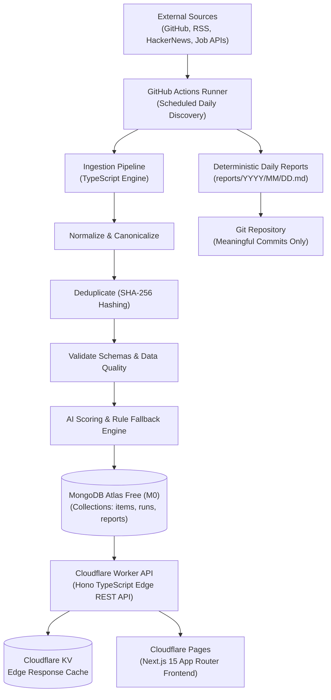

# DevAtlas

### Autonomous Developer Intelligence Platform

Discover. Understand. Stay ahead.

DevAtlas is an autonomous developer intelligence platform that continuously discovers developer tools, developer jobs, open-source repositories, AI models, security CVEs, and tech ecosystem changes, validates and AI-scores them, stores them in MongoDB Atlas, generates daily reports, and publishes the results automatically through a zero-cost serverless CI/CD pipeline.

[](https://github.com/somyajeet/DevAtlas/actions/workflows/ci.yml)
[](LICENSE)
[](docs/architecture.md)

---

## High-Level Architecture

DevAtlas runs completely on a **$0 free-tier serverless stack**:



---

## Monorepo Structure

```text
DevAtlas/
├── .github/
│   ├── workflows/
│   │   ├── ci.yml                 # PR & Push CI (Lint, Typecheck, Test, Build)
│   │   ├── daily-discovery.yml    # Scheduled discovery, AI processing, report & commit
│   │   ├── deploy.yml             # Deploy Worker & Pages to Cloudflare
│   │   ├── data-quality.yml       # Post-ingestion schema and validation checks
│   │   ├── security.yml           # Gitleaks, npm audit, SBOM generation
│   │   └── weekly-maintenance.yml # Job expiry purge & trend recalculation
│   ├── dependabot.yml             # Automated dependency updates
│   └── pull_request_template.md
├── frontend/                      # Next.js 15 App Router Frontend (Tailwind CSS, monochrome UI)
├── worker/                        # Cloudflare Worker REST API (Hono, MongoDB, Request IDs)
├── pipeline/                      # Ingestion Engine (Discovery, Deduplication, AI scoring)
├── reports/                       # Generated daily intelligence markdown reports
├── data/daily/                    # Deterministic JSON snapshots
├── docs/                          # Comprehensive architecture and operations documentation
├── Makefile                       # Developer commands (make dev, make test, make build)
├── package.json                   # Root workspace definition
└── .env.example                   # Documented configuration template
```

---

## Getting Started

### Prerequisites
- Node.js 20+ or 22+
- npm 10+
- (Optional) Docker for local MongoDB

### Quickstart

```bash
# 1. Clone repository
git clone https://github.com/somyajeet/DevAtlas.git
cd DevAtlas

# 2. Copy environment template
cp .env.example .env

# 3. Install all dependencies across workspaces
npm install

# 4. Run tests and typechecks
npm test
npm run typecheck

# 5. Start development servers
npm run dev
```

The frontend will run on `http://localhost:3000` and the Cloudflare Worker API on `http://localhost:8787`.

---

## Zero-Cost ($0) Architecture Principles

1. **Edge Execution**: The REST API runs on Cloudflare Workers edge nodes (free 100,000 requests/day).
2. **Free Document Store**: Data persists in MongoDB Atlas Free Tier (512MB M0 cluster).
3. **Compute on GitHub Actions**: Heavy discovery scraping, AI summarization, and data processing run inside free GitHub Actions minutes (2,000 min/mo).
4. **Resilient AI**: Supports `AI_PROVIDER=mock` or rule-based fallback by default, ensuring the pipeline never fails or requires paid API keys.
5. **Deterministic Git Commits**: Commits are pushed strictly when meaningful ecosystem data or daily reports actually change.

---

## License

MIT © DevAtlas Team
