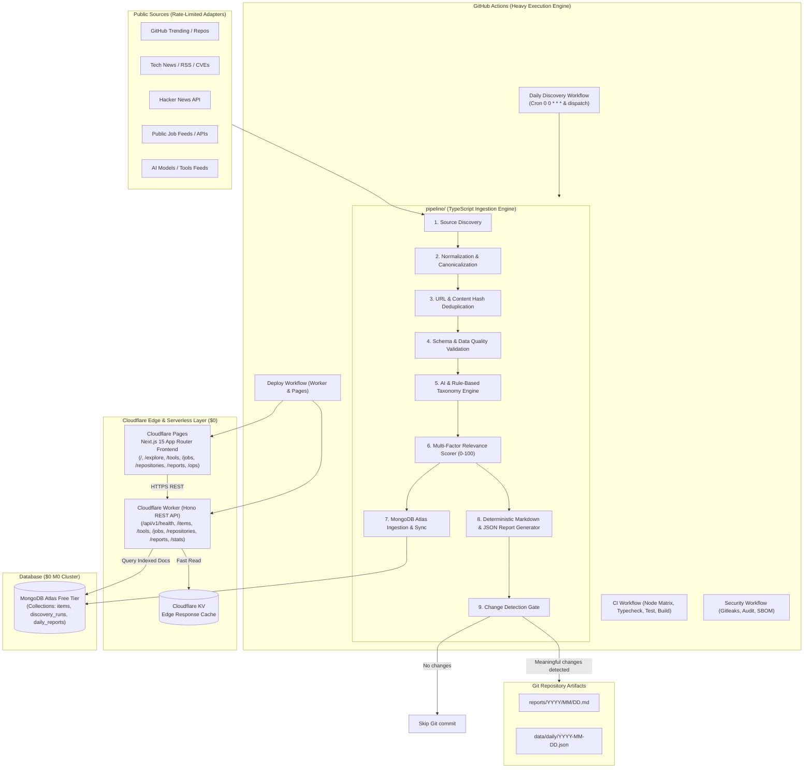
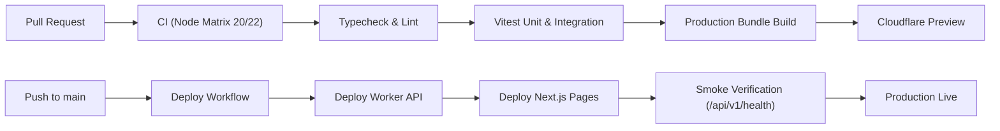

# DevAtlas

### Autonomous Developer Intelligence Platform

Discover. Understand. Stay ahead.

DevAtlas is a production-grade, portfolio-defining autonomous developer intelligence platform that continuously discovers useful developer ecosystem information, normalizes and deduplicates it, validates schemas and data quality, enriches it with AI scoring and taxonomies, stores it in MongoDB Atlas, synthesizes daily reports, and publishes results automatically via a zero-cost serverless CI/CD pipeline.

[](https://github.com/somyajeet/DevAtlas/actions/workflows/ci.yml)
[](https://github.com/somyajeet/DevAtlas/actions/workflows/daily-discovery.yml)
[](https://github.com/somyajeet/DevAtlas/actions/workflows/security.yml)
[](LICENSE)
[](docs/architecture.md)

---

## 1. Executive Summary & Design Philosophy

> “A real production system that happens to be an excellent CI/CD and DevOps demonstration.”

DevAtlas was built from the ground up to operate on a **$0 / free-tier serverless cloud architecture** without sacrificing production-grade practices. It decouples heavy compute (discovery ingestion, AI scoring, deduplication hashing, and report synthesis) into GitHub Actions, while serving sub-millisecond edge API responses via Cloudflare Workers and presenting a high-contrast developer interface with Next.js 15 on Cloudflare Pages.

---

## 2. High-Level Architecture Diagram



---

## 3. CI/CD Pipeline Flow



---

## 4. Key Platform Features

- **Autonomous Discovery**: Adapters for GitHub Trending, Hacker News official API, verified developer job boards, and technology RSS feeds.
- **Resilient Error Isolation**: A failure in one external source does not abort the run; the pipeline records partial status and processes remaining sources.
- **Deterministic Deduplication**: URL canonicalization (stripping tracking parameters, UTM codes, trailing slashes) and SHA-256 URL/content hashing.
- **Zero-Cost Resilient AI**: Rule-based taxonomy fallback ensures the system functions 100% reliably even when no external paid AI API keys are configured.
- **No Fake Commits**: The commit gate runs `git diff` on generated reports and commits strictly when genuine ecosystem data modifications occur.
- **Telemetry & Observability**: Dedicated `/ops` dashboard displaying live API latency, database connection status, pipeline execution duration, and data quality scores.

---

## 5. Free-Tier Resource Compliance ($0 Budget)

| Component | Service | Free Tier Allocation | DevAtlas Consumption |
| :--- | :--- | :--- | :--- |
| **Edge REST API** | Cloudflare Workers | 100,000 requests/day | Lightweight edge queries with sub-millisecond routing |
| **Frontend UI** | Cloudflare Pages | Unlimited requests & bandwidth | Next.js 15 static + server-rendered edge pages |
| **Database** | MongoDB Atlas | 512MB M0 cluster | Small document design, compound indexes, 90-day retention |
| **Batch Compute** | GitHub Actions | 2,000 runner minutes/month | Daily runs (~2 minutes/day ≈ 60 minutes/month) |
| **AI Intelligence** | Rule Engine / Mock | $0 (Zero external API cost) | Deterministic keyword taxonomy with optional cloud LLM |

---

## 6. Monorepo Structure

```text
DevAtlas/
├── .github/
│   ├── workflows/
│   │   ├── ci.yml                 # PR & Push CI (Node 20/22, Typecheck, Test, Build)
│   │   ├── daily-discovery.yml    # Scheduled discovery, AI scoring, report generator & commit
│   │   ├── deploy.yml             # Cloudflare Worker & Pages deployment with smoke tests
│   │   ├── security.yml           # Gitleaks secret scanning, npm audit, CycloneDX SBOM
│   │   ├── weekly-maintenance.yml # Retention cleanup (>90d job purge) & index check
│   │   └── release.yml            # Semantic release workflow with attached SBOM
│   ├── dependabot.yml             # Dependency updates configuration
│   └── pull_request_template.md   # Production PR template
├── frontend/                      # Next.js 15 App Router Frontend (Tailwind CSS, monochrome)
├── worker/                        # Cloudflare Worker REST API (Hono, MongoDB, Request IDs)
├── pipeline/                      # Ingestion Engine (Discovery, Deduplication, AI scoring)
├── reports/                       # Generated daily intelligence markdown reports
├── data/daily/                    # Deterministic JSON snapshots
├── docs/                          # In-depth architectural and operational guides
│   ├── architecture.md
│   ├── ci-cd.md
│   ├── data-pipeline.md
│   ├── deployment.md
│   ├── security.md
│   └── troubleshooting.md
├── scripts/
│   ├── detect-meaningful-changes.sh
│   ├── seed-dev-data.ts
│   ├── setup-db-indexes.ts
│   ├── smoke-test.ts
│   └── weekly-maintenance.ts
├── Makefile                       # Developer shortcuts (make dev, test, lint, seed, etc.)
├── package.json                   # Root workspace manifest
└── .env.example                   # Documented configuration template
```

---

## 7. Quickstart & Local Development

### 1. Clone and Install
```bash
git clone https://github.com/somyajeet/DevAtlas.git
cd DevAtlas
cp .env.example .env
npm install
```

### 2. Configure Database (Local or Remote)
To run with local MongoDB via Docker:
```bash
make mongo-up
make indexes
make seed
```

### 3. Run Development Servers
```bash
npm run dev
```
- Frontend: `http://localhost:3000`
- Worker API: `http://localhost:8787` (Health: `http://localhost:8787/api/v1/health`)

### 4. Execute the Discovery Pipeline
```bash
npm run dev --workspace=@devatlas/pipeline
```

### 5. Run Verification & Tests
```bash
npm test
npm run typecheck
npm run build
```

---

## 8. License

MIT © DevAtlas Team
