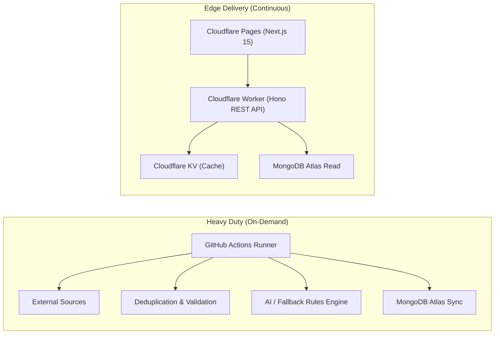

# DevAtlas Architecture & Technical Design

## 1. Executive Summary

DevAtlas is an autonomous developer intelligence and CI/CD showcase platform designed to run completely on **$0 free-tier cloud infrastructure**. It aggregates, normalizes, validates, deduplicates, AI-scores, and publishes software ecosystem intelligence daily.

## 2. Core Architectural Separation



### Why this division of labor?
- **Cloudflare Workers** have execution limits (10ms CPU time on free tier) and are optimized for sub-millisecond edge API responses.
- **GitHub Actions** provides 2,000 free minutes per month of full compute, where HTTP fetching, heavy text normalization, deduplication hashes, and report generation can execute without timeout constraints.

## 3. Data Flow & Normalization Pipeline

```text
RAW SOURCES (GitHub API, RSS, HackerNews API, Job Feeds)
   ↓
Normalization (Standardized schema, trim whitespace, normalize dates)
   ↓
Canonicalization (Strip tracking query params, remove trailing slashes)
   ↓
Deduplication (SHA-256 URL hash & content hash)
   ↓
Validation (Zod schema conformance, URL sanity check)
   ↓
Relevance Scoring (Freshness 25%, Popularity 25%, Dev Value 25%, Tech Impact 25%)
   ↓
AI Classification & Summarization (Provider SPI with Mock/Rule fallback)
   ↓
MongoDB Atlas Free Storage
   ↓
Daily Markdown & JSON Reports Generated
   ↓
Git Commit Gate (Commit ONLY if meaningful content changed)
```

## 4. Free-Tier Resource Management & Retention
- **MongoDB Atlas Free M0 Cluster**: 512MB storage limit.
- **Retention Rules**:
  - Daily intelligence reports: Permanent.
  - Important discoveries & cataloged AI tools: Permanent.
  - Developer job listings: 90 days retention.
  - Pipeline execution logs: 30 days retention.
